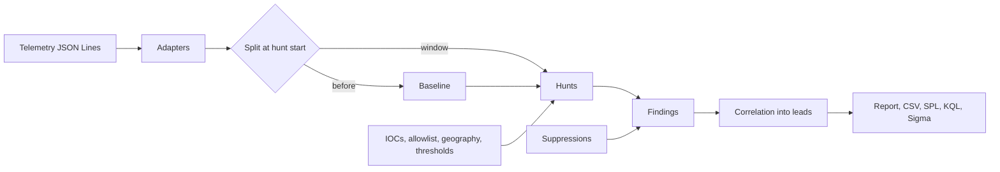

# Threat Hunting Agent

**Built by [Citadel Cloud Management](https://www.linkedin.com/company/citadel-cloud-management/)** — follow on LinkedIn for more engineering work like this.

Alerts tell you what a detection already knew. Hunting looks in the raw telemetry for what it did not.
This tool runs a library of hypothesis-driven hunts over process, authentication, DNS, network flow and
cloud audit logs, compares the hunt window with a learned baseline, and turns the results into ranked
leads. It also writes each hunt as a Splunk search, a Kusto query and, where the logic is pattern-based,
a Sigma rule, so a good hunt becomes a permanent detection.

It gives an analyst somewhere to start. Every finding says why it fired, what innocent things could cause it,
and lists the events behind it.

## What it does

| Stage | Component | Output |
| ----- | --------- | ------ |
| 1 | Adapters | Normalize Sysmon, authentication, DNS, flow and CloudTrail-style JSON Lines into one `Event` model, with secrets in command lines redacted |
| 2 | Baseline | Learns what is normal from events before the hunt window: which processes run where, which destinations each host contacts, daily outbound volume, which hosts a user signs in to, from which countries |
| 3 | Hunts | 11 hunts mapped to ATT&CK techniques, each returning findings with a score, evidence and benign explanations |
| 4 | Suppression | Applies reviewed, time-limited suppressions and reports the ones that expired |
| 5 | Correlation | Groups findings that share a host, user, address or domain into leads and ranks them |
| 6 | Output | Markdown and JSON report, findings CSV, and SPL, KQL and Sigma for every hunt that produced findings |



### The hunts

| Hunt | Looks for | Technique |
| ---- | --------- | --------- |
| `beaconing` | Regular, low-jitter connections from one host to one external address | T1071, T1573 |
| `dns_tunnel` | Many unique, long, high-entropy subdomains of one domain from one host | T1071.004, T1048.003 |
| `dga` | Many distinct random-looking domains that do not resolve | T1568.002 |
| `exfiltration` | Large outbound volume to a new destination or far above the host's baseline | T1041, T1048 |
| `password_attacks` | One source failing across many accounts (spray), or many failures then a success | T1110.003, T1110.001 |
| `impossible_travel` | The same account signing in from two countries within hours | T1078 |
| `lateral_fanout` | One account reaching many hosts it does not normally touch, quickly | T1021, T1078 |
| `process_chains` | Office spawning shells, encoded or downloading commands, signed binaries running remote content, credential dumping, web servers spawning shells, remote service execution | T1059, T1204, T1027, T1105, T1218, T1003, T1505.003, T1021.002 |
| `persistence` | Scheduled tasks, run keys, services, WMI subscriptions and startup items created from the command line | T1053.005, T1547.001, T1543.003, T1546.003 |
| `rare_process` | Programs on very few hosts that were never in the baseline, especially from writable folders or with names that imitate system binaries | T1036 |
| `cloud_abuse` | Root use, privilege changes without MFA, attempts to stop logging, enumeration bursts from a new address | T1078.004, T1098, T1562.008, T1526 |

## Quick start

```bash
python -m venv .venv && source .venv/bin/activate     # Windows: .venv\Scripts\activate
python -m pip install -e ".[dev]"

huntagent simulate --out feeds --start 2026-09-18
huntagent hunt -i sysmon=feeds/sysmon.jsonl -i auth=feeds/auth.jsonl -i dns=feeds/dns.jsonl \
    -i flow=feeds/flow.jsonl -i cloudtrail=feeds/cloudtrail.jsonl \
    --iocs configs/iocs.example.json --allowlist configs/allowlist.example.yaml \
    --geo configs/geo.example.yaml --suppressions configs/suppressions.example.yaml \
    --hunt-start 2026-09-18T00:00:00Z --out out
```

The simulator writes a normal week for about a dozen machines, then a hunt day that repeats normal activity and hides
nine attacks in it. It also plants four benign look-alikes that a good hunt should not report: a backup client
that beacons every five minutes, a vulnerability scanner that fails many sign-ins, a large upload to a CDN,
and a patching tool that fans out to eight hosts. Addresses come from the documentation ranges.

### Example output

```text
Hunted 1,056 events against a baseline of 5,509. 11 hunts ran and 0 were skipped. 17 findings (6 critical,
4 high, 6 medium, 1 low) were grouped into 7 lead(s). The top lead scores 100 and spans 6 attack tactic(s).
1 lead(s) match known-bad indicators. 1 finding(s) were suppressed as known benign.
```

| Lead | Score | Title | Tactics |
| ---- | ----- | ----- | ------- |
| L-C9EA0B21 | 100 | Regular connections from ws-004 to 203.0.113.66:443 (and 9 related findings) | Execution, Persistence, Defense Evasion, Lateral Movement, Command and Control, Exfiltration |
| L-D5A076A6 | 90 | deploy-bot tried to weaken cloud logging or detection (and 1 related finding) | Persistence, Defense Evasion |
| L-B10D43DE | 88 | Password spray from 198.51.100.23 against 12 accounts with a successful sign-in | Credential Access |
| L-4E70D49B | 80 | alice signed in from US and BR within 1.0 hours | Initial Access |
| L-B55659AA | 70 | Root account used 1 time(s) | Initial Access |
| L-49411C35 | 68 | svc-ci enumerated the environment from 198.51.100.88 | Discovery |
| L-643FE852 | 53 | ws-007 looked up 20 random-looking domains that do not exist | Command and Control |

The top lead is the whole intrusion in one place. An Office document started encoded PowerShell, which
downloaded a payload, created a scheduled task and ran a binary named `svch0st.exe`. The host then beaconed to
a command-and-control address every minute, tunnelled data through DNS, used an administrator account to reach
seven other hosts in 15 minutes, and the file server sent 180 MB to the same address.

The password spray is kept as its own lead on purpose. It named twelve accounts, one of which belongs to the
compromised workstation's user, but a finding that lists many users describes a campaign, so it does not link on
them.

A finding in the report looks like this:

```text
F-EA15A22C26 Regular connections from ws-004 to 203.0.113.66:443 (beaconing, score 100, T1071, T1573)

120 connections about every 60 seconds with jitter 0.05 (threshold 0.2). The host had never contacted this
address before.

Possible benign causes: software update checks; monitoring or backup agents; chat and mail clients polling;
heartbeat services.
```

followed by a table of the actual events. The secret that the simulator puts on one command line
(`-password hunter2xyz`) is redacted before storage and never reaches a report.

### From a hunt to a detection

```bash
huntagent query process_chains --lang sigma     # seven Sigma rules generated from the rule table
huntagent query beaconing --lang spl
huntagent query cloud_abuse --lang kql
```

`hunt --out DIR` writes the queries and rules for every hunt that found something, under `queries/` and `sigma/`.
Statistical hunts (beaconing, DNS tunnelling, DGA, exfiltration, spray, travel, fan-out and rare process) have SPL and KQL only,
because Sigma cannot express them.

## Commands

| Command | Purpose |
| ------- | ------- |
| `hunts` | List the hunts with the data each needs |
| `simulate --out DIR [--start DATE] [--seed N]` | Write synthetic telemetry |
| `hunt -i FORMAT=PATH ... [config options] [--window 24h] [--hunt-start ISO] [--baseline-days N] [--only HUNT] [--out DIR] [--format md,json] [--fail-on-lead SEVERITY]` | Run hunts. Formats are `sysmon`, `auth`, `dns`, `flow`, `cloudtrail` and `generic` |
| `coverage [-i FORMAT=PATH ...] [--kinds a,b]` | Which hunts can run with the data you have, and which techniques are blind |
| `query HUNT [--lang spl\|kql\|sigma]` | Print a hunt as a query or Sigma rules |

Exit codes: 0 success, 1 a `--fail-on-lead` gate failed, 2 invalid input.

Without `--hunt-start` the window ends just after the newest event. Everything before the window is the
baseline, or the last `--baseline-days` days of it.

## Configuration

Environment variables use the `HUNTAGENT_` prefix, and `.env.example` documents each one.

| File | Purpose |
| ---- | ------- |
| `configs/thresholds.example.yaml` | Every hunt parameter, with defaults |
| `configs/iocs.example.json` | Known-bad addresses, domains and hashes. A match adds 15 points and marks the lead |
| `configs/allowlist.example.yaml` | Known-benign destinations, scanners, trusted processes and noisy accounts |
| `configs/geo.example.yaml` | Address ranges and countries for impossible travel |
| `configs/suppressions.example.yaml` | Reviewed suppressions with a reason, an approver and an expiry |

Some hunts step aside when they cannot work rather than guess. Impossible travel needs a geography file, and
rare-process hunting needs a baseline with process data. The report says which hunts were skipped and why.

## How findings are scored

Each hunt starts from a base score for the pattern and adds points for the evidence, for example regularity and
connection count for beaconing, or a successful sign-in after a spray. Findings map to severity at 45, 70 and 85.
A lead takes its best finding's score and adds 5 points for each extra ATT&CK tactic, up to 15. Read
`hunts/*.py` for every formula.

## Limitations

Read these before you rely on the output.

- The telemetry adapters follow common public field names. Real exports vary with product, version and
  configuration. Validate each adapter on a sample of your own data before trusting a hunt that depends on it.
- The defaults are starting points, not tuned values. Every environment has its own beacons, scanners and
  batch jobs. Expect to tune thresholds and add allowlist entries.
- Statistical hunts need a baseline. A few days of history is a minimum, and the report warns when it is short.
- The hunts do not cover every technique. The `coverage` command shows what is covered given your data, and the
  blind techniques are listed explicitly.
- The Sigma rules, SPL and KQL are generated from the hunt logic as starting points. Test them against your own
  schema and field names before deploying them as detections.
- Leads are triage, not verdicts. A lead can be wrong in both directions, and a hunt that finds nothing is not
  proof of absence.
- Geography for impossible travel is only as good as the range file you supply, and VPN egress is a common cause
  of false positives.
- It reads log files. There are no live connectors to SIEMs, EDR or cloud accounts.

## Development

```bash
make lint        # ruff check and format check
make typecheck   # mypy --strict
make cov         # tests with an 80% coverage gate (currently about 98%)
make audit       # pip-audit on runtime dependencies
```

The 230-plus tests run offline. They cover the statistics, every adapter, each hunt firing and staying quiet,
allowlists, suppressions, correlation rules, the report escaping, and a full simulated intrusion through the
service and the CLI. See [CONTRIBUTING.md](CONTRIBUTING.md) and [docs/architecture.md](docs/architecture.md).

## Docker

```bash
docker build -t hypothesis-threat-hunting-agent .
docker run --rm -v "$PWD:/work" hypothesis-threat-hunting-agent simulate --out feeds --start 2026-09-18
```

## License

MIT. See [LICENSE](LICENSE).
