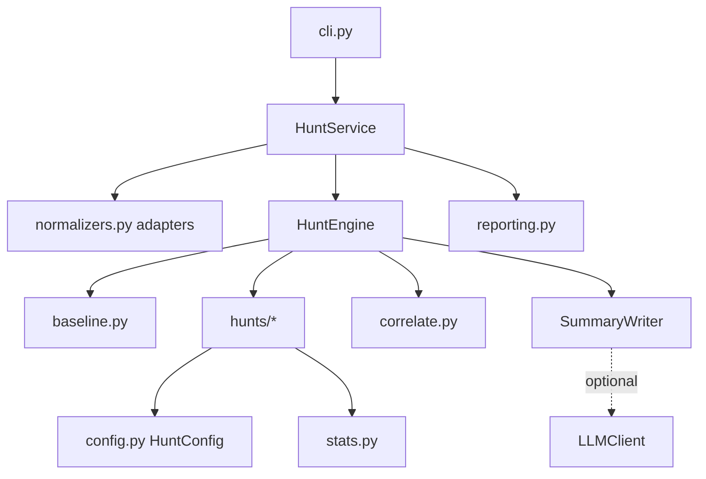

# Architecture

## Overview

`huntagent` is a stateless batch pipeline. It reads telemetry files, splits them at the hunt start into a
baseline and a hunt window, runs each hunt over the window, applies suppressions, correlates the findings into
leads, and renders the result. The composition root (`container.build_service`) wires the engine and the summary
writer, and `HuntService` is the facade the CLI and library callers use.

## Modules

| Module | Responsibility |
| ------ | -------------- |
| `models.py` | `Event`, `Thresholds`, `Finding`, `Lead`, `Suppression` and report models |
| `normalizers.py` | One adapter per source format, line-by-line ingestion with size and count limits |
| `config.py` | Settings and `HuntConfig`: thresholds, indicators, allowlists, geography, suppressions |
| `baseline.py` | Sets and samples learned from events before the hunt window |
| `stats.py` | Entropy, coefficient of variation, robust z-score, intervals and edit distance |
| `hunts/base.py` | `HuntContext`, `make_finding`, severity bands and shared helpers |
| `hunts/network.py` | Beaconing, DNS tunnelling, DGA and exfiltration |
| `hunts/identity.py` | Password attacks, impossible travel and lateral fan-out |
| `hunts/endpoint.py` | Process chains, persistence and rare processes, driven by a rule table |
| `hunts/cloud.py` | Root use, privilege changes without MFA, logging tamper and enumeration |
| `correlate.py` | Union-find over shared entities, lead scoring and next steps |
| `engine.py` | Windows, skipping, suppression, warnings and coverage |
| `reporting.py` | Markdown, JSON, CSV, SPL, KQL and Sigma output |
| `simulate.py` | Deterministic week of normal activity plus a hunt day with attacks and look-alikes |

## A hunt

A hunt is a class with an identifier, a tactic, the ATT&CK techniques it covers, the event kinds it needs, and
three methods: `run(ctx)` returning findings, `spl(thresholds)` and `kql(thresholds)`. Pattern-based hunts also
implement `sigma(thresholds)`. `unavailable(ctx)` lets a hunt explain why it cannot run, for example when no
geography file is configured.

`HuntContext` gives a hunt the window's events grouped by kind and in time order, the `Baseline`, and the
`HuntConfig`. `make_finding` builds the finding: it sorts the evidence, caps it at 50 events, adds 15 points for
an indicator match, clamps the score and derives a stable identifier from the hunt, title, entities and first
event time.

## Baseline

Built from events strictly before the window: which hosts ran each process, which external addresses each host
contacted, a daily outbound byte total per host, which hosts each user signed in to, which countries each user
signed in from, cloud source addresses per user, and the domains seen. Hunts use these sets to say whether
something is new.

## Correlation

Findings become nodes. Two findings are linked when they share a host, user, address or domain and are within
`lead_window_hours` of each other. A finding that lists more than 3 users, 10 hosts or 5 addresses does not link on
that list, because it describes a campaign and would merge unrelated victims. Each connected group becomes a lead
scored from its best finding plus 5 points per additional tactic, with next steps for each hunt involved.

## Rule tables

Process and persistence hunting use `ProcessRule` entries (parent set, image set, command-line regex, score,
tactic, techniques, benign causes). The same table produces the findings and the Sigma rules, so a detection
cannot drift from the hunt that inspired it.

## Determinism

The output depends only on the events, the configuration and the window. There is no clock access, and event and
finding ids are content hashes.

## Extending

- New hunt: add a `Hunt` subclass, register it in `hunts/__init__.py`, add a pivot in `correlate.PIVOTS`, and test
  when it fires, when it stays quiet, and how each threshold changes the outcome.
- New source format: write an adapter in `normalizers.py` and register it in `NORMALIZERS`. Test it with a sample
  from the real product.
- New process rule: add a `ProcessRule`. Detection and Sigma output update together.
